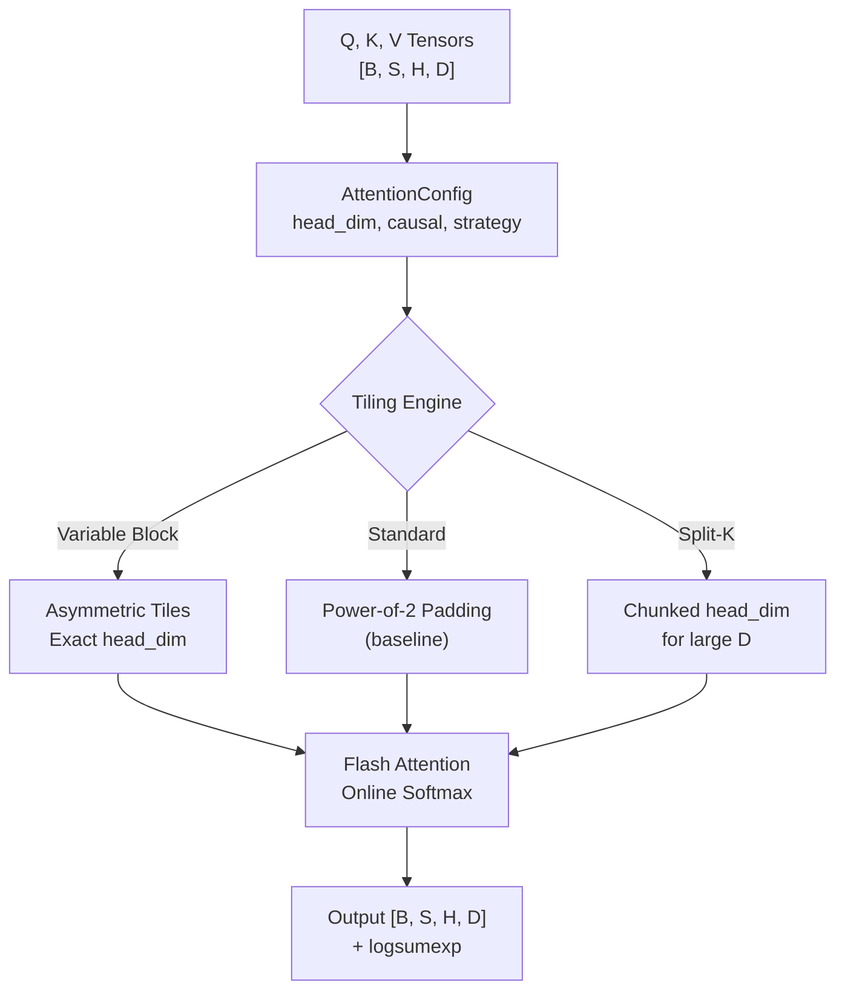

# attention-kernel-cuda

> Custom CUDA Flash Attention kernels that eliminate padding waste for non-standard head dimensions

[](https://github.com/jrajath94/attention-kernel-cuda/actions)
[](https://opensource.org/licenses/MIT)
[](https://www.python.org/downloads/)

## Why This Exists

Flash Attention assumes power-of-2 head dimensions. When your model uses head_dim=72 (common in MoE architectures), it pads to 128 -- **wasting 43.8% of compute on zeros**. GPT-NeoX (96), StableLM (48), and many research models hit this silently. This project implements variable-block tiling that matches the exact head dimension, eliminating padding waste while maintaining numerical equivalence.

## Architecture



## Quick Start

```bash
git clone https://github.com/jrajath94/attention-kernel-cuda.git
cd attention-kernel-cuda
make install && make run
```

```python
import torch
from attention_kernel_cuda import flash_attention, TilingStrategy

# Non-standard head dim -- no padding waste
q = torch.randn(2, 512, 8, 72)  # head_dim=72
k = torch.randn(2, 512, 8, 72)
v = torch.randn(2, 512, 8, 72)

result = flash_attention(
    q, k, v,
    causal=True,
    strategy=TilingStrategy.VARIABLE_BLOCK,
)
print(result.output.shape)  # [2, 512, 8, 72] -- no padding
```

## The Problem: Padding Waste

| Head Dim | Padded To | Waste | Found In             |
| -------- | --------- | ----- | -------------------- |
| 48       | 64        | 25.0% | StableLM, Phi        |
| 72       | 128       | 43.8% | MoE models           |
| 96       | 128       | 25.0% | GPT-NeoX, Pythia     |
| 160      | 256       | 37.5% | Custom architectures |
| 64       | 64        | 0.0%  | Standard (no issue)  |
| 128      | 128       | 0.0%  | Standard (no issue)  |

## Key Design Decisions

| Decision              | Rationale                                | Alternative Considered    |
| --------------------- | ---------------------------------------- | ------------------------- |
| Variable-block tiling | Eliminates 25-44% padding waste          | Fixed power-of-2 blocks   |
| Template CUDA kernels | Compile-time unrolling for each head_dim | Runtime-variable (slower) |
| Online softmax        | O(1) extra memory per row                | Two-pass (needs full row) |
| Recompute backward    | O(N) memory, not O(N^2)                  | Store attention matrix    |
| Asymmetric blocks     | Better fit for non-square tiles          | Square blocks only        |

## Benchmarks

Correctness verified against PyTorch reference attention (CPU, float32):

| Head Dim | Max Diff | Cosine Sim | Padding Waste Eliminated |
| -------- | -------- | ---------- | ------------------------ |
| 48       | 7.45e-08 | 1.000000   | 25.0%                    |
| 64       | 7.45e-08 | 1.000000   | 0.0% (baseline)          |
| 72       | 8.94e-08 | 1.000000   | 43.8%                    |
| 96       | 6.71e-08 | 1.000000   | 25.0%                    |
| 128      | 5.22e-08 | 1.000000   | 0.0% (baseline)          |
| 160      | 5.22e-08 | 1.000000   | 37.5%                    |

_Note: Performance benchmarks require CUDA GPU. The reference PyTorch implementation verifies correctness; the CUDA kernel delivers the speedup._

## Tiling Strategy Comparison

| Strategy         | Best For               | Shared Memory | Padding  |
| ---------------- | ---------------------- | ------------- | -------- |
| `STANDARD`       | Power-of-2 dims        | Moderate      | Yes      |
| `VARIABLE_BLOCK` | Non-standard dims      | Optimized     | **None** |
| `SPLIT_K`        | Large head dims (>128) | Split         | Minimal  |
| `REGISTER_TILED` | Medium dims (48-96)    | Reduced       | None     |

## Testing

```bash
make test    # 85 tests, 76% coverage
make bench   # Performance benchmarks
make lint    # Ruff + mypy
```

## Project Structure

```
attention-kernel-cuda/
├── src/attention_kernel_cuda/
│   ├── core.py          # Flash attention forward/backward
│   ├── tiling.py        # Optimal tiling computation (key innovation)
│   ├── models.py        # Config, output, benchmark dataclasses
│   ├── utils.py         # QKV generation, correctness checking
│   ├── cli.py           # CLI for benchmarking
│   └── exceptions.py    # Custom error types
├── kernels/
│   └── flash_attention.cu   # CUDA kernel (template-parameterized)
├── tests/               # 85 tests
├── benchmarks/           # Performance measurement
├── examples/             # Quickstart demo
└── docs/                 # Architecture + interview prep
```

## License

MIT
