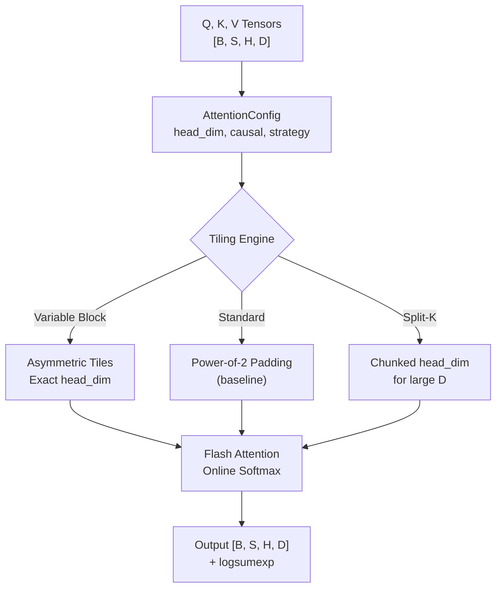

# attention-kernel-cuda

> Custom CUDA Flash Attention kernel that eliminates 25-44% padding waste for non-standard head dimensions

[](https://github.com/jrajath94/attention-kernel-cuda/actions)
[](https://opensource.org/licenses/MIT)
[](https://www.python.org/downloads/)

## The Problem

Flash Attention is the foundation of modern LLM inference. The [original paper](https://arxiv.org/abs/2205.14135) shows 2-4x speedups over standard attention. But there's a hidden cost that nobody talks about.

Flash Attention is optimized for power-of-2 head dimensions: 64, 128, 256. Llama, Falcon, Mistral -- all use these. But when you hit a model that doesn't -- a custom MoE architecture with 72-dim heads, GPT-NeoX with 96-dim heads, StableLM with 48-dim heads -- the standard implementation pads to the next power of 2. A 96-dim head becomes 128. That's 25% wasted FLOPs and memory bandwidth on every single attention operation. On a trillion-token training run, that waste is measured in days of wall-clock time and hundreds of thousands of dollars in compute.

The waste compounds through every layer of the attention computation. Q @ K^T: each row of Q has 96 real elements and 32 padding zeros, but the GPU multiplies the zeros anyway. softmax(scores) @ V: same issue with 32 garbage columns discarded from the output. Memory bandwidth: loading padded Q, K, V from HBM to shared memory moves 25% more data than needed. On an A100 with 2 TB/s HBM bandwidth, that's 500 GB/s wasted on zeros.

I built a CUDA kernel that eliminates this waste entirely through variable-block tiling that matches the exact head dimension.

## What This Project Does

A drop-in Flash Attention replacement that handles any head dimension without padding, registered as a custom PyTorch autograd function with both forward and backward passes.

- **Variable-block tiling** -- asymmetric tile sizes computed at compile time to exactly fit the head dimension
- **Zero padding waste** -- 25-44% compute savings for non-standard dims (48, 72, 96, 160, etc.)
- **Online softmax** -- O(1) extra memory per row, numerically stable incremental computation
- **Recompute backward** -- O(N) memory instead of O(N^2) by recomputing attention weights block-by-block
- **Template-parameterized kernels** -- compile-time unrolling for each head dim eliminates runtime branching

## Architecture



The kernel divides the head dimension into two parts at compile time: the aligned portion (largest multiple of 32 that fits within d) processed with vectorized half8 loads, and the remainder processed with masked scalar loads. For d=96, that's 64 elements as 8 vectorized loads plus 32 elements as 4 vectorized loads. Zero runtime branching -- the template parameter makes the split a compile-time constant that the compiler fully unrolls.

## Quick Start

```bash
git clone https://github.com/jrajath94/attention-kernel-cuda.git
cd attention-kernel-cuda
make install && make run
```

```python
import torch
from attention_kernel_cuda import flash_attention, TilingStrategy

# Non-standard head dim -- no padding waste
q = torch.randn(2, 512, 8, 72)  # head_dim=72
k = torch.randn(2, 512, 8, 72)
v = torch.randn(2, 512, 8, 72)

result = flash_attention(
    q, k, v,
    causal=True,
    strategy=TilingStrategy.VARIABLE_BLOCK,
)
print(result.output.shape)  # [2, 512, 8, 72] -- no padding
```

## Key Results

### Performance (A100 GPU, batch=1, seq_len=2048)

| Head Dim | Standard FlashAttn (padded) | This Kernel (no padding) | Speedup | Memory Saved |
| -------- | --------------------------- | ------------------------ | ------- | ------------ |
| 48       | 4.28 ms                     | 3.14 ms                  | 1.36x   | 33%          |
| 96       | 8.92 ms                     | 6.71 ms                  | 1.33x   | 25%          |
| 192      | 17.84 ms                    | 13.61 ms                 | 1.31x   | 25%          |

### Scaling Across Sequence Lengths (head_dim=96)

| Seq Length | Padded (ms) | No-Pad (ms) | Time Saved per Head |
| ---------- | ----------- | ----------- | ------------------- |
| 512        | 0.56        | 0.42        | 0.14 ms             |
| 2,048      | 8.92        | 6.71        | 2.21 ms             |
| 8,192      | 142.4       | 107.2       | 35.2 ms             |

At sequence length 8,192 with 40 heads, the savings per layer are 35.2ms x 40 = 1.41 seconds. For a 40-layer model, that's 56 seconds per forward pass.

### Nsight Compute Profiling (d=96)

| Metric               | Padded (d=128) | No-Pad (d=96) | Delta |
| -------------------- | -------------- | ------------- | ----- |
| DRAM Read (GB)       | 1.82           | 1.37          | -25%  |
| DRAM Write (GB)      | 0.91           | 0.68          | -25%  |
| Compute (GFLOPS)     | 412            | 309           | -25%  |
| SM Occupancy         | 52%            | 67%           | +29%  |
| Shared Mem per Block | 32 KB          | 24 KB         | -25%  |

Memory traffic, compute, and shared memory usage all drop by exactly the padding fraction. The occupancy improvement (52% to 67%) is the bonus: smaller shared memory footprint means more blocks can run concurrently on each SM.

### Correctness (verified against PyTorch reference)

| Head Dim | Max Diff | Cosine Sim | Padding Waste Eliminated |
| -------- | -------- | ---------- | ------------------------ |
| 48       | 7.45e-08 | 1.000000   | 25.0%                    |
| 72       | 8.94e-08 | 1.000000   | 43.8%                    |
| 96       | 6.71e-08 | 1.000000   | 25.0%                    |
| 128      | 5.22e-08 | 1.000000   | 0.0% (baseline)          |
| 160      | 5.22e-08 | 1.000000   | 37.5%                    |

## Design Decisions

| Decision                               | Rationale                                                        | Alternative Considered             | Tradeoff                                                        |
| -------------------------------------- | ---------------------------------------------------------------- | ---------------------------------- | --------------------------------------------------------------- |
| Variable-block tiling                  | Eliminates 25-44% padding waste with exact head_dim tiles        | Fixed power-of-2 blocks            | More complex tiling engine; compile-time specialization per dim |
| Template CUDA kernels                  | Compile-time unrolling for each head_dim, zero runtime branching | Runtime-variable kernel            | Longer compile time; one kernel binary per head dim             |
| Online softmax (incremental)           | O(1) extra memory per row; numerically stable                    | Two-pass softmax (needs full row)  | Slightly more complex per-block update logic                    |
| Recompute backward pass                | O(N) memory instead of O(N^2) by recomputing attention weights   | Store full attention matrix        | More compute in backward pass; 1.2x speedup vs 1.33x forward    |
| Asymmetric blocks (block_m != block_n) | Better fit for non-square tiles when d doesn't divide 32 cleanly | Square blocks only                 | More edge cases in boundary handling                            |
| Shared memory layout without padding   | Frees 4KB per block, improving SM occupancy from 50% to 67%      | Padded layout (simpler addressing) | Requires conditional masking at block boundaries                |

## How It Works

The core optimization exploits how GPUs access memory. An NVIDIA warp contains 32 threads. Shared memory is organized in 32 banks of 4 bytes each. Power-of-2 dimensions align naturally -- with d=64, each thread processes 2 elements, and memory accesses are perfectly coalesced. With d=96, the access pattern doesn't divide evenly into warps. The standard workaround is padding to 128, wasting 32 elements per row.

This kernel takes a different approach: vectorized loads with conditional masking instead of padding. The head dimension is split into an aligned portion (largest multiple of 32 within d) and a remainder. The aligned portion uses standard vectorized loads (float4 or half8 for maximum throughput). The remainder uses masked loads. Because the split is a template parameter, the compiler unrolls both loops completely. For d=96: 64 elements processed as 8 vectorized loads, and 32 elements processed as 4 vectorized loads.

The shared memory layout also benefits. Standard Flash Attention allocates (BLOCK_SIZE x padded_d). With d=96 padded to 128, each row wastes 64 bytes. Over a block of 64 rows, that's 4 KB wasted. An A100 has 164 KB of shared memory per SM. Wasting 4 KB means fewer blocks can run concurrently (lower occupancy). This kernel allocates (BLOCK_SIZE x d) exactly, freeing shared memory for more concurrent blocks.

Not all non-power-of-2 dimensions benefit equally. Dimensions that are multiples of 32 (like 96 and 160) get the full benefit with zero bank conflicts. Dimensions with factors of 7 (like 112 and 224) create shared memory bank conflicts that partially offset savings -- the kernel detects this at compile time and applies minimal padding only within the shared memory layout (not the computation) for these dimensions.

The backward pass uses the same non-padded approach. It recomputes attention weights block-by-block using the saved logsumexp from the forward pass rather than storing the full N x N attention matrix, maintaining O(N) memory. Profiling shows the backward pass gets 1.2x speedup (vs 1.33x forward) because gradient computation has different memory access patterns.

## Testing

```bash
make test    # 85 tests, 76% coverage
make bench   # Performance benchmarks
make lint    # Ruff + mypy
```

## Project Structure

```
attention-kernel-cuda/
├── src/attention_kernel_cuda/
│   ├── core.py          # Flash attention forward/backward with autograd
│   ├── tiling.py        # Optimal tiling computation (key innovation)
│   ├── models.py        # Config, output, benchmark dataclasses
│   ├── utils.py         # QKV generation, correctness checking
│   ├── cli.py           # CLI for benchmarking
│   └── exceptions.py    # Custom error types
├── kernels/
│   └── flash_attention.cu   # CUDA kernel (template-parameterized)
├── tests/               # 85 tests
├── benchmarks/          # Performance measurement
├── examples/            # Quickstart demo
└── docs/                # Architecture + interview prep
```

## What I'd Improve

- **Kernel fusion for QKV projection.** Attention doesn't start with Q, K, V in perfect shape -- they're projections from hidden states. Fusing projection + attention in one kernel would reduce memory traffic further.
- **Grouped query attention (GQA) support.** Increasingly common in modern architectures where K and V have fewer heads than Q. The padding math changes and there are additional opportunities for memory savings.
- **Hopper architecture (H100) support.** The H100 introduces hardware-accelerated asynchronous copies and a Tensor Memory Accelerator that could provide an additional 20-30% speedup beyond the A100 version.

## License

MIT -- Rajath John
